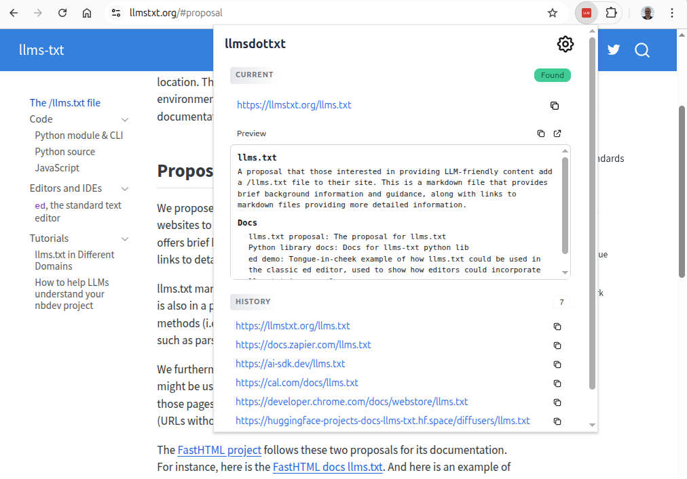

# llmsdottxt

A Chrome extension that detects `llms.txt` files on websites and makes it easy to discover and copy URLs for use with your favorite LLM.



## Getting Started

### Installation

1. **Download the extension**
   ```bash
   git clone https://github.com/YOUR_USERNAME/llmsdottxt.git
   ```
   Or download and extract the [ZIP file](https://github.com/YOUR_USERNAME/llmsdottxt/archive/refs/heads/main.zip)

2. **Open Chrome Extensions page**
   - Navigate to `chrome://extensions/` in your browser
   - Or go to Menu (three dots) > Extensions > Manage Extensions

3. **Enable Developer Mode**
   - Toggle the "Developer mode" switch in the top right corner

4. **Load the extension**
   - Click "Load unpacked"
   - Select the `llmsdottxt` folder you downloaded
   - The extension icon will appear in your toolbar

5. **Pin the extension** (recommended)
   - Click the puzzle piece icon in the toolbar
   - Click the pin icon next to "llmsdottxt"

### Updating

To update to the latest version:
```bash
cd llmsdottxt
git pull
```
Then go to `chrome://extensions/` and click the refresh icon on the llmsdottxt card.

### Quick Start

1. Visit a site with an llms.txt file (e.g., [docs.anthropic.com](https://docs.anthropic.com))
2. The extension icon turns **red** when an llms.txt is detected
3. Click the icon to see the URL and preview the content
4. Copy the URL or raw content to paste into your favorite LLM

## About llms.txt

The [llms.txt specification](https://llmstxt.org/) was created by [Jeremy Howard](https://www.answer.ai/posts/2024-09-03-llmstxt.html) of Answer.AI in September 2024. It proposes a standardized way for websites to provide LLM-friendly content.

### The Problem

Large language models increasingly rely on website information, but face a critical limitation: context windows are too small to handle most websites in their entirety. Converting complex HTML pages with navigation, ads, and JavaScript into LLM-friendly plain text is difficult and imprecise.

### The Solution

The llms.txt specification suggests websites add a `/llms.txt` file containing markdown-formatted content that provides:
- Brief background information and guidance
- Links to markdown files with detailed information
- Structured documentation that LLMs can easily consume

Since its introduction, thousands of documentation sites—including Anthropic and Cursor—have adopted llms.txt.

**Learn more:**
- [Official Specification](https://llmstxt.org/)
- [Original Proposal by Jeremy Howard](https://www.answer.ai/posts/2024-09-03-llmstxt.html)

## What This Extension Does

**llmsdottxt** helps you discover llms.txt files as you browse the web:

- **Automatic Detection**: Checks for llms.txt at the current path on every page you visit
- **Visual Indicator**: Icon changes color when an llms.txt file is found
- **Quick Access**: Click the extension icon to view the content and copy the URL
- **History Tracking**: Keeps track of recently discovered llms.txt files
- **Reader View**: Open llms.txt files in a dedicated full-page reader
- **Markdown Rendering**: Optionally renders content as formatted markdown

## Features

- Detects llms.txt files automatically on page load
- One-click copy of llms.txt URLs for pasting into LLM conversations
- Preview content directly in the popup panel
- Full-page reader for longer documents
- History of recently found llms.txt URLs
- Configurable markdown rendering
- Dark/light mode support (follows system preference)

## Usage

1. **Browse normally** - The extension automatically checks for llms.txt files
2. **Look for the icon** - A colored icon indicates an llms.txt was found
3. **Click the icon** - View the URL, preview content, and access history
4. **Copy the URL** - Use the copy button or press Ctrl+C to copy the current llms.txt URL
5. **Open in Reader** - Click the reader icon for a full-page view

### Settings

Access settings via the gear icon in the popup or right-click the extension icon:

- **History Count**: Number of recent URLs to remember (default: 5)
- **Render as Markdown**: Toggle markdown formatting on/off
- **Display frontmatter in reader**: Show/hide YAML frontmatter

## Browser Compatibility

- Google Chrome
- Chromium-based browsers (Edge, Brave, Opera)

## Privacy

- No analytics or telemetry
- All data stored locally in your browser
- Only fetches llms.txt from sites you visit
- No external requests except to the current site

## License

MIT
# llmsdottxt_chrome
